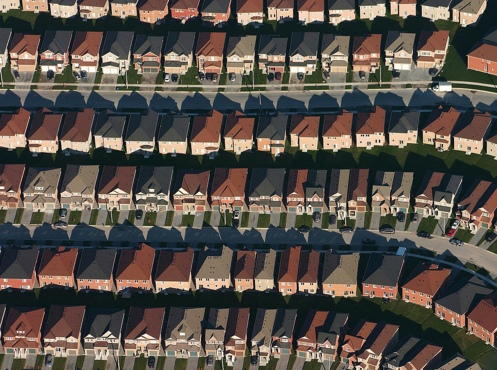

# House Prices: Advanced Regression Techniques
## Kaggle Challenge

Solution to the Kaggle House Prices challenge.
<p align="center">
  
</p>

## Getting Started
Run Jupyter Notebook:
```
jupyter notebook
```
Navigate to __Kaggle House Prices.ipynb__ and run it.

## Requirements
numpy==1.16.2  
pandas==0.24.2  
scikit-learn==0.20.3  
seaborn==0.9.0  
Boruta==0.3

For more, see requirements.txt

## Authors

* **Bjørnar Kjenaas Mælum** - [bmaelum](https://github.com/bmaelum)

## License

This project is licensed under the MIT License - see the [LICENSE.md](LICENSE.md) file for details
